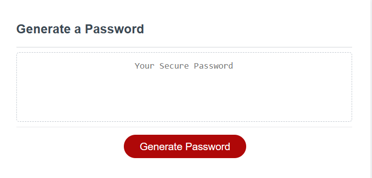

# generatePassword
## New&Improved-Password-Generator

As a systems security analyst I want to be able to recommend a password
protocol that generates a random password based on user input. AS a user
inputs length of password he is prompted to select upper/lower case. special
characters, and numbers. The password generator then takes that data to 
initiate a secure randomly selected password.
This project contained starter code.
I was greatly aided in this project by Trinh Nguyen my tutor.

https://github.com/nightsha/generatePassword

